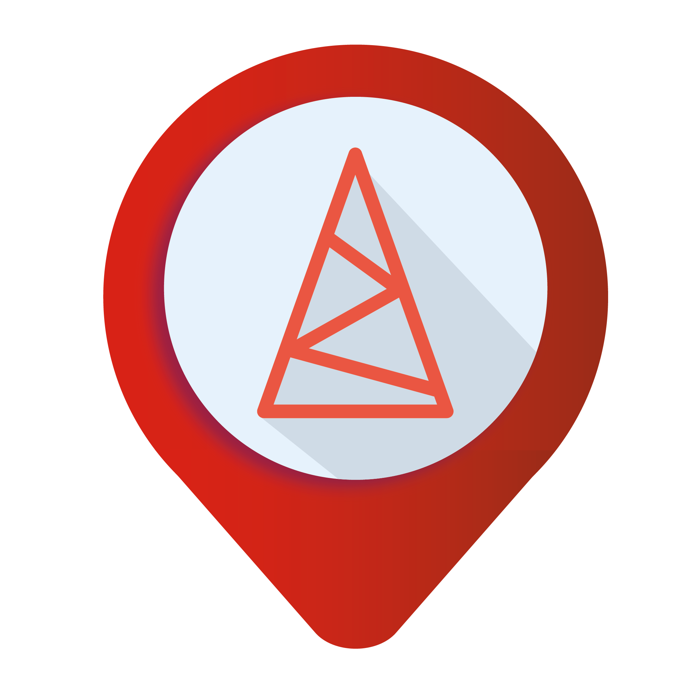

  <h1> Hello < Developers/ >, I'm Nilton Cesar!  </h1>
  

  
  
  
### 👨🏻‍💻 &nbsp;About Me
  
💡 &nbsp;I like to explore new technologies and develop software solutions and quick hacks.\
🌱 &nbsp;I'm on track to learn more about User Experience, User Interface and Back End.\
✍️ &nbsp;In my free time, I pursue Graphic Design and Blog Writing as hobbies/side hustles.\
💬 &nbsp;Feel free to reach out to me for pro bono consulting and volunteering, or just for some interesting discussion.\
✉️ &nbsp;You can shoot me an email at niltoncesarjr1@gmail.com! I'll try to respond as soon as I can.\
📄 &nbsp;Please have a look at my [Résumé](https://www.aindanaotem.com/resume.html) for more details about me. I'm open to feedback and suggestions! 

### 🛠 &nbsp;Git Stats
  
   

### 🛠 &nbsp;Tech Stack
 
 ##### &nbsp; Languages
  
  
  
  
  
  
  
    
  ##### &nbsp; Frameworks
 
  
  
  
  
  
  
  
  
  
  
  
 
  ##### &nbsp;Git and Addons
  
  
  
  
  
  
  ##### &nbsp;Design
   
  
  
  
  
  ##### &nbsp;Preferred IDEs, Prototyping Platforms & Tools 
  
  
  
  
  
  
  
  ### 🛠 &nbsp;Projects
  
 

  
  ### 🛠 &nbsp;Work Experience
  
  

Full-Stack Developer Web && Mobile \
[Autodomo](https://github.com/AutoDomo/) • 
Smart Places Systems \
Software Engineer \
Languages & Technologies: `JavaScript`, `Node JS`, `React JS`, `React Native`, `Expo`, `Firebase`
  ### 🛠 &nbsp;Projects
_In the overview below you will find my most recent work experience:_
  
  

  **GeoRede** \
  [**Aguiar Engenharia**](https://www.aguiareng.com.br/) • Full-Stack Developer \
  Languages & Technologies: `ReactJS`, `React Native`, `JavaScript`, `Node JS`, `Firebase`, `Expo`\
  Project Description: _Georeferencing application with web and mobile compatibility._
 
    

  

  **Autodomo** \
  [**Autodomo**](https://autodomo.com.br/) • Full-Stack Developer \
  Languages & Technologies: `ReactJS`, `React Native`, `JavaScript`, `Node JS`, `Firebase`, `Expo`\
  Project Description: _System that integrates smart sensors and triggers into a single platform that is fully compatible with HomeKit (Apple Device.)_
 

   

  ### 🛠 &nbsp;Contact
  
  
  
  
  
  
  
  
  
 
